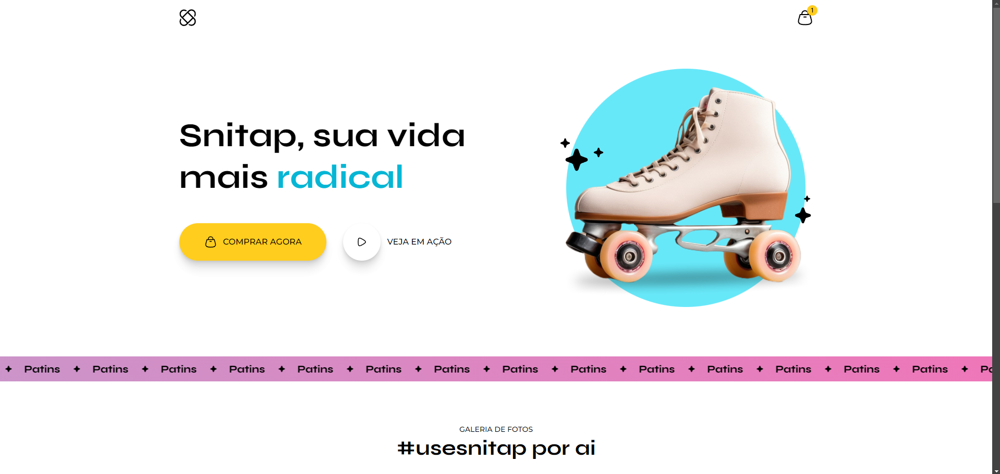

<h1 align="center"> 🛼 Snitap 🛼 </h1>

Projeto pessoal utilizando conceitos HTML e CSS.

  <a href="#-tecnologias">Tecnologias</a>&nbsp;&nbsp;&nbsp;|&nbsp;&nbsp;&nbsp;
  <a href="#-projeto">Projeto</a>&nbsp;&nbsp;&nbsp;|&nbsp;&nbsp;&nbsp;
  <a href="#-layout">Layout</a>&nbsp;&nbsp;&nbsp;

 

  

## 🚀 Tecnologias

Esse projeto foi desenvolvido com as seguintes tecnologias:

-   HTML e CSS
-   Git e GitHub
-   Figma

## 💻 Projeto

Snitap é uma landing page de apresentação e venda de patins. <a href="https://snitap-bice.vercel.app/" target="_blank" rel="noopener noreferrer">aqui</a> para testar a página.

## 🎨 Layout

Clique <a href="https://www.figma.com/design/jwuELh8xEK65lnAA0gfVK6/LP-de-patins-animada-(Community)?m=auto&is-community-duplicate=1&fuid=1050974991944149827">aqui</a> para conhecer a prototipagem do projeto.
 
 
 
 

Desenvolvido com ♥ by Mateus de Castro Macedo 👨‍💻

